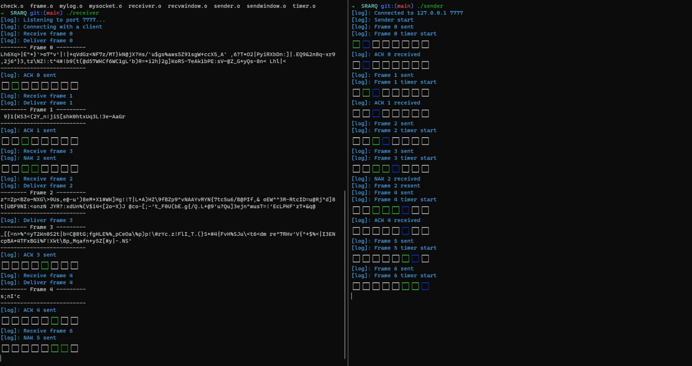

# SRARQ
Simulate the process of SRARQ

SRARQ 算法模拟

- [x] Receiver
    - [x] Frame
        - [x] CheckFrame
        - [x] ReceiveFrame
        - [x] SendACK
        - [x] SendNAK
    - [x] ReceiverWindow
        - [x] initWindow
        - [x] isInWindow
        - [x] isFrameExist
        - [x] StoreFrame
        - [x] PurgeFrame
        - [x] ExtractData
- [x] Sender
    - [x] Frame
        - [x] MakeFrame
        - [x] SendFrame
        - [x] ReceiveACK
    - [x] SenderWindow
        - [x] InitWindow
        - [x] isBetween
        - [x] isInWindow
        - [x] StoreFrame
        - [x] PurgeFrame
        - [x] GetFrame
    - [x] Timer
        - [x] StartTimer
        - [x] StopTimer
        - [x] TimeOut
- [x] Makefile
- [x] Debug
    - [x] 1st: Program works correctly
    - [x] 2nd: Add packet loss rate

